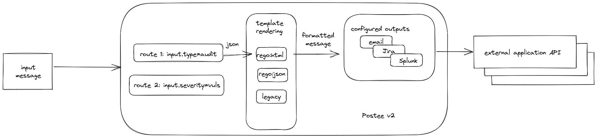

![Docker Pulls][docker-pull]
[![Go Report Card][report-card-img]][report-card]

[![License][license-img]][license]

[download]: https://img.shields.io/github/downloads/khulnasoft-lab/hooker/total?logo=github
[release-img]: https://img.shields.io/github/release/khulnasoft-lab/hooker.png?logo=github
[release]: https://github.com/khulnasoft-lab/hooker/releases
[docker-pull]: https://img.shields.io/docker/pulls/khulnasoft/hooker?logo=docker&label=docker%20pulls%20%2F%20hooker
[go-doc-img]: https://godoc.org/github.com/khulnasoft-lab/hooker?status.svg
[report-card-img]: https://goreportcard.com/badge/github.com/khulnasoft-lab/hooker
[report-card]: https://goreportcard.com/report/github.com/khulnasoft-lab/hooker
[license-img]: https://img.shields.io/badge/License-mit-blue.svg
[license]: https://github.com/khulnasoft-lab/hooker/blob/master/LICENSE

Hooker is a simple message routing application that receives input messages through a webhook interface, and can take enforce actions using predefined outputs via integrations.

Watch a quick demo of how you can use Hooker:

Primary use of Hooker is to act as a message relay and notification service that integrates with a variety of third-party services. Hooker can also be used for sending vulnerability scan results or audit alerts from Khulnasoft Platform to collaboration systems.

In addition, Hooker can also be used to enforce pre-defined behaviours that can orchestrate actions based on input messages as triggers.

## Status
Although we are trying to keep new releases backward compatible with previous versions, this project is still incubating,
and some APIs and code structures may change.

## Documentation
The official [Documentation] provides detailed installation, configuration, troubleshooting, and quick start guides.

---
Hooker is an [Khulnasoft Security](https://khulnasoft.com) open source project.  
Learn about our [Open Source Work and Portfolio].  
Join the community, and talk to us about any matter in [GitHub Discussions] or [Slack].

[Documentation]: https://khulnasoft-lab.github.io/hooker/latest
[Open Source Work and Portfolio]: https://www.khulnasoft.com/products/open-source-projects/
[Slack]: https://slack.khulnasoft.com/
[GitHub Discussions]: https://github.com/khulnasoft-lab/hooker/discussions

## Release

1. Bump version of [helm chart](https://github.com/khulnasoft-lab/hooker/blob/main/deploy/helm/hooker/Chart.yaml).
1. (By repository admin) Create a new tag. Hooker and helm charts are automatically released by github actions.
1. (By repository admin) Run [publish-docs workflow](https://github.com/khulnasoft-lab/hooker/blob/main/.github/workflows/publish-docs.yml), if document has been updated.
