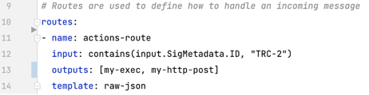
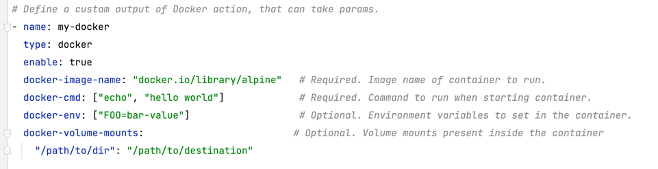

# Hooker Actions

## Motivation
Proper alert management can help security practitioners make informed decisions about their codebase. However, security alerts can cause fatigue if acting on them isn’t possible. Hooker, an open source security alert management tool, helps mitigate some of those concerns. It enables teams to define routes and rules by which alerts are handled and redirected to 

## User Stories
In a typical Hooker setup, users can configure the tool to receive events from a variety of sources over a webhook. This allows for ease of use in existing environments. Furthermore, users can configure Hooker to process these incoming events and, based on logic defined via Rego rules, send them to different actions.

As a, **Hooker User**
- _I want_, to be able to remove a vulnerable image from my cluster upon a Vul scan  
_So that_, I can keep such images unavailable for deployment.


- _I want_, to ship Tracker security notification logs from my node when events are detected   
_So that_, I can build a timelog for forensics purposes.


- _I want_, to be able to add labels to my deployments when Starboard detects a vulnerable image in my cluster   
_So that_, I can effectively tag my resources.


## Configuring Hooker Actions
In this README, we’ll walk through a scenario in which a user wants to act on a security event received from Tracker, an open source runtime security tool. In this scenario, the user will set up the Hooker Exec Action to save logs for forensic purposes and then use the Hooker HTTP Action to ship the saved logs to a remote server.

In this case, the incoming security event from Tracker is received by Hooker and evaluated by the following route YAML definition: 



As seen above, the route has a Rego rule that evaluates the input to contain a certain signature ID, TRC-2, which represents anti-debugging activity. In addition, if the input is matched, the output is triggered.

## Exec Action

In this case, we call the Exec Action first and then the HTTP Action. They are defined as the following:

The Exec Action can take in the following parameters:

| Option      | Usage                                                                                     |
|-------------|-------------------------------------------------------------------------------------------|
| env         | Optional, custom environment variables to be exposed in the shell of the executing script |
| input-file  | Required, custom shell script to executed                                                 |
| exec-script | Required, inline shell script executed                                                    |

The Exec Action also internally exposes the `$HOOKER_EVENT` environment variable with the input event that triggered the action. This can be helpful in situations where the event itself contains useful information.

Below is an example of using `$HOOKER_EVENT`. It uses the inline exec-script script:


As you can see, we capture the incoming Hooker event and write this event to the Tracker event log for forensic purposes.

## HTTP Action

Finally, we can configure the Hooker HTTP Post Action to ship the captured event logs via our HTTP Action to our remote server.

 

| Option   | Usage                                   |
|----------|-----------------------------------------|
| URL      | Required, URL of the remote server      |
| Method   | Required, e.g., GET, POST               |
| Headers  | Optional, custom headers to send        |
| Timeout  | Optional, custom timeout for HTTP call  |
| Bodyfile | Optional, input file for HTTP post body |

To run Hooker in the container, we can invoke the Hooker Docker container:

```
docker run --rm --name=hooker \
-v <path-to-cfg>:/config/cfg-actions.yaml  \
-e HOOKER_CFG=/config/cfg-actions.yaml \
-e HOOKER_HTTP=0.0.0.0:8084  \
-e HOOKER_HTTPS=0.0.0.0:8444  \
-p 8084:8084 -p 8444:8444 khulnasoft-lab/hooker:latest
```

## Kubernetes Action
In addition to the Exec and HTTP actions, we have also implemented a Kubernetes action that today can add labels and annotations to pods. It can be used as follows:


| Option              | Usage                                                                                                                           |
|---------------------|---------------------------------------------------------------------------------------------------------------------------------|
| kube-namespace      | Required. Kubernetes namespace to use.                                                                                          |
| kube-config-file    | Required. Path to .kubeconfig file                                                                                              |
| kube-label-selector | Required, if specifying labels or annotations.                                                                                  |
| kube-actions        | Optional, key-value pair of labels and annotations<br/>Labels must be added via "labels" key and Annotations via "annotations". |


## Docker Action
We have also added a Docker Action, that can help you run docker images as an action within a container.



| Option               | Usage                                                                                                                                                                    |
|----------------------|--------------------------------------------------------------------------------------------------------------------------------------------------------------------------|
| docker-image-name    | Required. Image name of the docker image.                                                                                                                                |
| docker-cmd           | Required. Command to run inside the docker image.                                                                                                                        |
| docker-env           | Optional. Environment variables to set in the container.                                                                                                                 |
| docker-network       | Optional. Connect the action container to the specified network. {e.g. "host"}                                                                                           |
| docker-volume-mounts | Optional*. Volume mounts present inside the container.<br/> * _If you have specified volume mounts, you also need to pass them through into the hooker docker container_ |

### Note
When running Hooker in a Docker container, it is required to mount the Docker socket within the Hooker container to be able to spin up Docker Action container instances. This can be done as follows:
```
docker run --rm --name=hooker --group-add $(stat -c '%g' /var/run/docker.sock) -v /var/run/docker.sock:/var/run/docker.sock -v /path/to/cfg.yaml:/config/cfg.yaml  -e HOOKER_CFG=/config/cfg.yaml -e HOOKER_HTTP=0.0.0.0:8084     -e HOOKER_HTTPS=0.0.0.0:8444     -p 8084:8084 -p 8444:8444 khulnasoft-lab/hooker:latest
```

If you have specified volume mounts for a docker container and use Hooker in a docker container as well, remember to mount them within the Hooker container as well:
```
docker run --rm --name=hooker --group-add $(stat -c '%g' /var/run/docker.sock) -v /var/run/docker.sock:/var/run/docker.sock -v /path/to/cfg.yaml:/config/cfg.yaml  -v /my/custom/volume:/my/custom/volume -e HOOKER_CFG=/config/cfg.yaml -e HOOKER_HTTP=0.0.0.0:8084     -e HOOKER_HTTPS=0.0.0.0:8444     -p 8084:8084 -p 8444:8444 khulnasoft-lab/hooker:latest
```