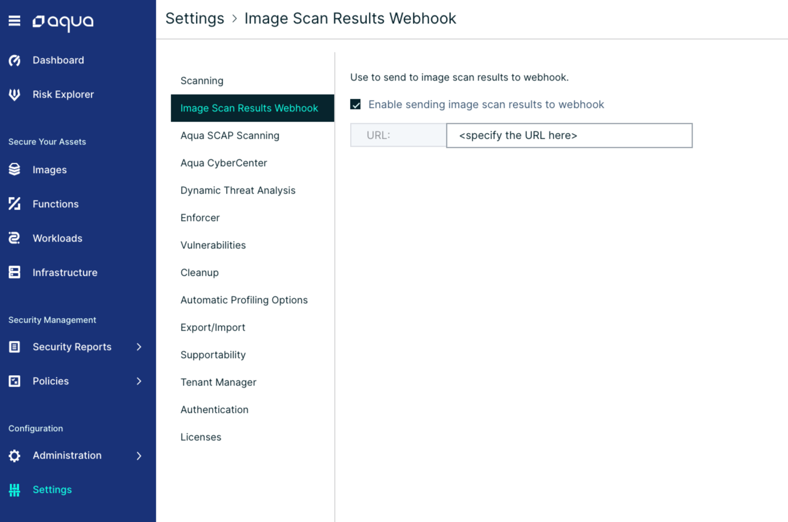
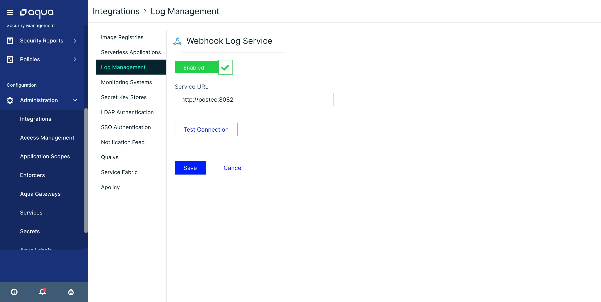

## Configure the Khulnasoft Server with Webhook Integration
Hooker can be integrated with Khulnasoft Console to deliver vulnerability and audit messages to target systems.

You can configure the Khulnasoft Server to send a Webhook notification whenever a new vulnerability is found.
Navigate to the **Image Scan Results Webhook** page, under the "Settings" menu.

Click "Enable sending image scan results to webhook", and specify the URL of Hooker.
Now, scan an image and look at the Hooker log files - you will see that Hooker have received an incoming message once scan is done,
and that the message was routed based on the cfg.yaml configuration.

You can also configure the Khulnasoft Server to send a Webhook notification for every audit message.
Navigate to the **Log Management** page, under the "Integrations" menu.

Click on the "Webhook" item, and specify the URL of Hooker.

Now every audit event in Khulnasoft will be sent to Hooker. You can configure routes and input message conditions in Hooker cfg.yaml to
forward appropriate messages to target systems.

The **Hooker URL** is in the following formats:

> `https://<Hooker IP or DNS>:8445`
> `http://<Hooker IP or DNS>:8082`

!!! tip
        For more details about the Hooker URL installed using kubernetes [click here](./deploy/kubernetes/README.md)

### Validate the Integration

To validate that the integration is working, you can scan a new image for security vulnerabilities from the Khulnasoft Server UI (Images > Add Image > Specify Image Name > Add).

When vulnerabilities are found in an image, you will see that a JIRA ticket is created/ Email is received/ Slack message is posted to the channel.

!!! tip
        To troubleshoot the integration, you can look at both the Khulnasoft Hooker container logs and the Khulnasoft Server logs. Use the "docker logs <container name>" command to view these logs.*

