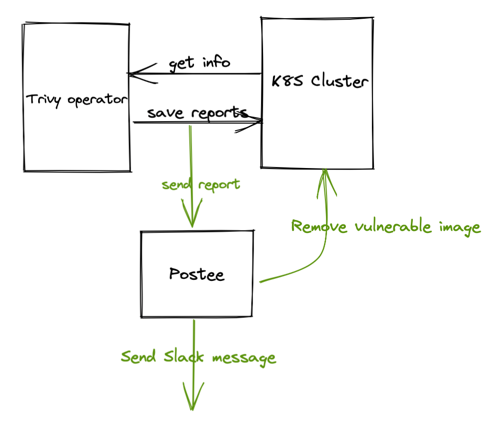

# Vul Operator 

## Introduction
In this walk through, configure [Vul Operator](https://github.com/khulnasoft-lab/vul-operator), a Kubernetes native security toolkit that helps security practitioners detect vulnerabilities, secrets and other misconfigurations in their Kubernetes clusters. We will configure Vul Operator to send the generated reports to Hooker, whereby Hooker can take necessary actions on the incoming reports for example, removing vulnerable images.

## Scenario
A DevOps team would like to configure alerts for their Kubernetes cluster to observe any security vulnerabilities or secrets getting exposed during deployments. This is especially important in those scenarios where compliance can fall out of place during active usage. For this they decide to install Vul Operator, and use the [Webhook integration](https://khulnasoft-lab.github.io/vul-operator/latest/integrations/webhook/) to send the reports to Hooker.

They decide to configure Hooker so that upon receiving such reports, Hooker can action upon them as desired, which could include taking actions such as sending alerts to operators, creating JIRA tickets etc.



## Sample Configs
In this case a sample configuration for the components can be described as follows:

### Hooker Config

```yaml
routes:
- name: Vul Operator Alerts
  input: input.report.summary.criticalCount > 0 # You can customize this based on your needs
  actions: [send-slack-msg]
  template: vul-operator-slack

# Templates are used to format a message
templates:
- name: vul-operator-slack
  rego-package: hooker.vuloperator.slack

# Actions are target services that should consume the messages
actions:
- name: send-slack-msg
  type: slack
  enable: true
  url: <slack webhook url>
```

If all goes well, you should see a report in your Slack channel next time it is generated.
