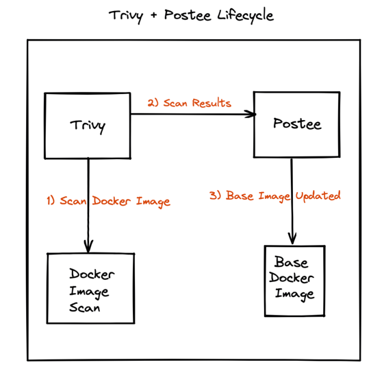

# Vul Vulnerability Scan

## Introduction
In this walkthrough, we will setup vulnerability scanning with [Vul](https://github.com/khulnasoft-lab/vul) and send the results to Hooker for creation of JIRA tickets as an example.

A video format of this guide is also available [here](https://youtu.be/HZ5Z8jAVH8w?t=420).

## Scenario
A DevOps team would like to configure alerts for scheduled vulnerability scans to notify them about any vulnerable images that they might be running in their clusters. For this they decide to install Vul, run it on a schedule and send the results to Hooker.

They decide to configure Hooker so that upon receiving such alerts, Hooker creates a JIRA ticket for them to take a look at it at their disposal.



## Sample Configs
In this case a sample configuration for the components can be described as follows:

### Hooker Config
```yaml
routes:
- name: vul-alpine-vulns
  input: contains(input.Metadata.OS.Family, "alpine")
  actions: [my-jira]
  template: vul-raw-json

# Templates are used to format a message
templates:
- name: vul-raw-json
  rego-package: hooker.rawmessage.json

# Actions are target services that should consume the messages
actions:
- name: my-jira
  type: jira
  enable: true
  url: "https://foo.bar.com"
  user: "jdoe@foo.bar.com"
  password: "hunter2"
  project-key:   "ABC"
  board:     "Backlog"
  labels:    ["vul-vulns"]
```

### Vul Webhook Plugin
[Vul Webhook Plugin](https://github.com/khulnasoft-lab/vul-plugin-webhook) is a Vul plugin that lets you send Vul scan results to a webhook listening on an endpoint. In this case we can make use of it as follows:

#### Install the plugin
```shell
vul plugin install https://github.com/khulnasoft-lab/vul-plugin-webhook
```

#### Run the Vul scan using the plugin
```shell
vul webhook -- --url=<hooker-endpoint> -- <vul args>
```