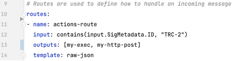
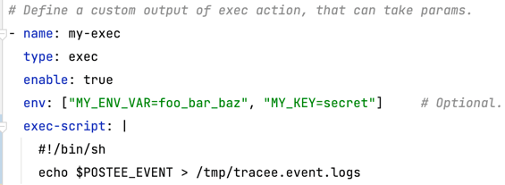
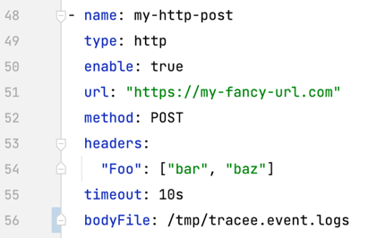

In this demo, we’ll walk through a scenario in which a user wants to act on a security event received from Tracker, an open source runtime security tool. In this scenario, the user will set up the Hooker Exec Action to save logs for forensic purposes and then use the Hooker HTTP Action to ship the saved logs to a remote server.

In this case, the incoming security event from Tracker is received by Hooker and evaluated by the following route YAML definition:



As seen above, the route has a Rego rule that evaluates the input to contain a certain signature ID, TRC-2, which represents anti-debugging activity. In addition, if the input is matched, the output is triggered.

## Exec Action

In this case, we call the Exec Action first and then the HTTP Action. They are defined as the following:

The Exec Action can take in the following parameters:

| Option      | Usage                                                                                     |
|-------------|-------------------------------------------------------------------------------------------|
| env         | Optional, custom environment variables to be exposed in the shell of the executing script |
| input-file  | Required, custom shell script to executed                                                 |
| exec-script | Required, inline shell script executed                                                    |

The Exec Action also internally exposes the `$HOOKER_EVENT` environment variable with the input event that triggered the action. This can be helpful in situations where the event itself contains useful information.

Below is an example of using `$HOOKER_EVENT`. It uses the inline exec-script script:



As you can see, we capture the incoming Hooker event and write this event to the Tracker event log for forensic purposes.

## HTTP Action

Finally, we can configure the Hooker HTTP Post Action to ship the captured event logs via our HTTP Action to our remote server.



| Option   | Usage                                   |
|----------|-----------------------------------------|
| URL      | Required, URL of the remote server      |
| Method   | Required, e.g., GET, POST               |
| Headers  | Optional, custom headers to send        |
| Timeout  | Optional, custom timeout for HTTP call  |
| Bodyfile | Optional, input file for HTTP post body |

To run Hooker in the container, we can invoke the Hooker Docker container:

```
docker run --rm --name=hooker \
-v <path-to-cfg>:/config/cfg-actions.yaml  \
-e HOOKER_CFG=/config/cfg-actions.yaml \
-e HOOKER_HTTP=0.0.0.0:8084  \
-e HOOKER_HTTPS=0.0.0.0:8444  \
-p 8084:8084 -p 8444:8444 khulnasoft-lab/hooker:latest
```

