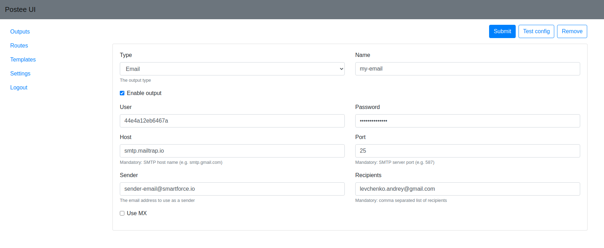

Hooker provides a simple Web UI to simplify the configuration management.

## Configure and run Hooker UI application

### Requirements
Hooker Admin application shares location of `cfg.yaml` with main webhook app, also Bolt database needs to be in folder which is available for both apps.

!!! danger
        If application config is submitted by UI app then all yaml comments are removed. So if comments are important please make backup of config yaml.

### Kubernetes for Hooker UI application

The manifest is [here](https://github.com/khulnasoft-lab/hooker/blob/main/deploy/kubernetes/hooker.yaml).

It will expose a service `hooker-ui-svc` in the port `8000`.

`http://hooker-ui.default.svc.cluster.local:8000`

### Docker Image for Hooker UI application
Dockerfile to build image for UI app is [here](Dockerfile.ui)

### Orchestration example (Docker Compose)
There is an example of [docker-compose.yml](docker-compose.yml) that can be used to simplify deploying of both app. Notice that two shared volumes are used. One is for Bolt db and second to store app config. To start apps use: `docker-compose up`.

### Environment variables
Name | Description | Default value
--- | --- | ---
HOOKER_UI_CFG|Path to app config| required, no default value
HOOKER_UI_PORT|Port to use with UI app| 8090
HOOKER_UI_UPDATE_URL|Url of webhook application|required
HOOKER_ADMIN_USER|Admin account name|admin
HOOKER_ADMIN_PASSWORD|Admin account password|admin
